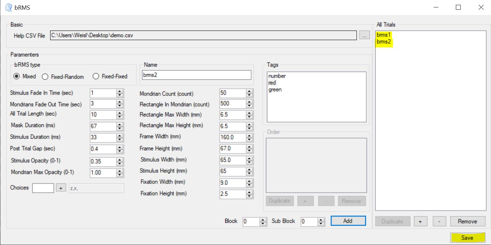
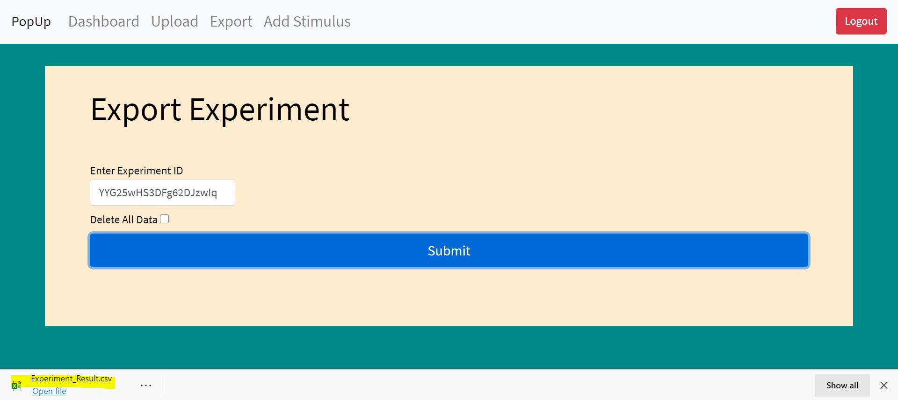

Demo Experiment
================

Preparations
-------------

Download this two images and call them 2.jpg and 4.jpg

Create CSV file called "BrmsDemo.csv" struct as follow

You can see that we set two tags for each picture,
their color and tha fact that they are numbers.

Main settings
---------------

Now I open BrmsGenerator - Researcher and set "Name" to "Demo" and "Background Color" to "#C0C0C0" (Grey).

Add Instructions
------------------

Now add instructions trial.

Get in instructions form.

Create new page with the text "Here is a demo experiment!" and call this trial
"Instructions".

Enter confirm and save the trial.

Add bRMS
-----------

Now add bRMS trial.

Get in bRMS trial form

Upload the CSV file we created before to bRMS form.

Create bRMS trial called "brms1" with all the default
values and the letter 'z' as a choice and press the "Add" button.

Create bRMS trial called "brms2" and add the 'x' letter to the choices section.

.. image:: images/rms3.JPG
   :width: 400

Save both trials.

Download experiment
----------------------

Download the experiment to your computer by press the "Save" button,
Dont change its name.

Upload experiment JSON file
-----------------------------

Log in to http://www.hujilabconscious.com/ and navigate to "Upload" web page.

Upload the JSON file downloaded earlier in the section below.

Press the "Submit" button.

Wait for success message.

Upload Stimulus
-----------------

Compress 2.jpg and 4.jpg to Stimulus.zip and
navigate to "Add stimulus" web page.

Enter experiment name, in this case - "Demo" int the following section.

Upload the ZIP file created earlier in the following section.

Wait until the age reload.

Upload stimulus
-----------------

Compress 2.jpg and 4.jpg to Stimulus.zip and
navigate to "Add stimulus" web page.

Enter experiment name, in this case - "Demo" int the following section.

Upload the ZIP file created earlier in the following section.

Wait until the age reload.

Run experiment
-----------------

Navigate to "Dashboard" web page.

Look at the table and find Demo experiment

Press on the link tab

Export
-------

Get the experiment ID from "Dashboard" web page

Navigate to "Export" web page.

Enter our experiment ID in the following section.

Press on "Submit" button

Watch how the experiment result downloaded to your computer

