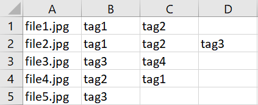
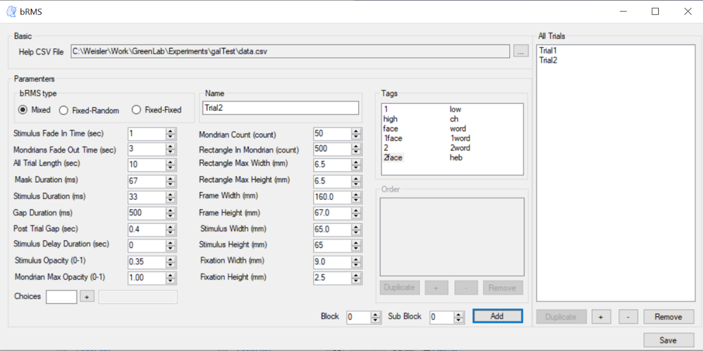

Application Forms
===================

Main Form
-------------
In bRMS generator - Researcher we generate new bRMS experiment JSON file.
Experiment must include:

•	Name

•	At least one Trial

•	Background color (RGB code)

Each trial can be edited (edit button) remove (remove button) and reorder (+ and – buttons). Each trial also includes a name, block, and sub block.
To save the experiment file press on the “Save” button and a file save dialog will open. 

.. image:: images/main_form.png
   :width: 400

bRMS
-------------

bRMS experiment contains stimulus and mask
parts. On the stimulus part one of your
stimulus picture will appear after a fade
in time. The mask part contains several
modrians in different colors, switching
places and colors between each other.

The mask part is not mandatory,
if you want to disable it, just set the
Mask Duration to be 0.

Each component size can be change,
but be aware that change one size can harm the harmony of the experiment, and please be cautious with it.
First of all we need to import data
CSV file, contains all stimuli names on the
first column and stimulus tags on each
columns, tags  order are irrelevant.

**CSV file example**

After uploading the CSV file we could can create our bRMS trials.

We have 3 bRMS types

•	Mixed: Shuffle all stimulus together.

•	Fixed-Random: Each tag runs in a separate block.

•	Fixed-Fixed: Fixed order .

After choosing the bRMS type we could continue edit our bRMS trial.
Mandatory (with no default):

•	Trial name: unique trial name, should be indicative.

•	Tags: list view of all stimulus tags.

•	Choices: buttons for experiment response. Should be numeric  or alphabetic.

Extras:

•	Stimulus fade in time (sec)

•	Mondrian fade out time  (sec)

•	All Total trial length (sec)

•	Mask duration (ms)

•	Stimulus duration (ms)

•	Post trial gap  (ms)

•	Stimulus opacity (0-1)

•	Mondrian max opacity (0-1)

•	Mondrian count (count)

•	Rectangle count in mondrian (count)

•	Rectangle max width (mm)

•	Rectangle max height (mm)

•	Frame width (mm)

•	Frame height (mm)

•	Stimulus width (mm)

•	Stimulus height (mm)

•	Fixation width (mm)

•	Fixation height (mm)

Survey
-------------
There are 4 survey types

•	Text

•	Multi choice

•	Scale

•	Scale custom

After we choose a survey type we should add at least one question,
the questions form will be according to the survey type,
as explain in the next chapter.

.. image:: images/survey_form.png
   :width: 400

Questions
-------------

**Text Question:**

Text question contain a textbox for the question text and row and columns for textbox size,
row is height and columns in width.

.. image:: images/text_question_form.png
   :width: 400

**Multi \ Custom Scale Question:**

Multi choice and custom scale questions contains grid of options,
added by write on the textbox and press Add.
We can duplicate, remove and reorder the options by pressing the relevant buttons.

Also we have the prompt textbox, which contains the question itself.

.. image:: images/multi_question_form.png
   :width: 400

**Scale Question:**

Scale question contains "start", "middle" and "end" labels and "scale count".
The first, middle and last scale points will be the relevant label, the rest will be numbers.

.. image:: images/scale_question_form.png
   :width: 400

Image
-------------

On Image trial we upload an image by
press Choose Image button, then file dialog
will open and you will be able to choose
image from your computer.
After choosing the image will display in
the Display Image section, for save
press the Save button.

.. image:: images/image_form.png
   :width: 400