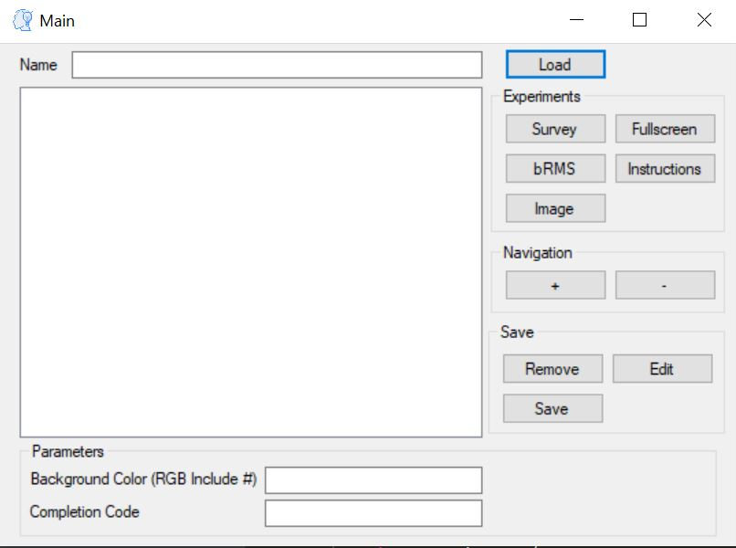
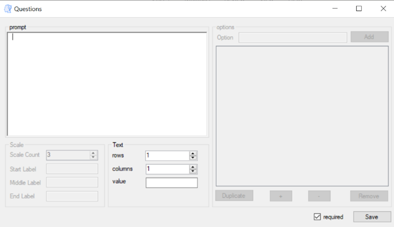

Application Forms
===================

Main Form
-------------
In bRMS generator - Researcher we generate new bRMS experiment JSON file.
Experiment must include:

•	Name

•	At least one Trial

•	Background color (RGB code)

Each trial can be edited (edit button) remove (remove button) and reorder (+ and – buttons). Each trial also includes a name, block, and sub block.
To save the experiment file press on the “Save” button and a file save dialog will open. 

Survey
-------------
There are 4 survey types

•	Text

•	Multi choice

•	Scale

•	Scale custom

After we choose a survey type we should add at least one question,
the questions form will be according to the survey type,
as explain in the next chapter.

Questions
-------------

**Text Question:**

Text question contain a textbox for the question text and row and columns for textbox size,
row is height and columns in width.

**Multi \ Custom Scale Question:**

Multi choice and custom scale questions contains grid of options,
added by write on the textbox and press Add.
We can duplicate, remove and reorder the options by pressing the relevant buttons.

Also we have the prompt textbox, which contains the question itself.

**Scale Question:**

Scale question contains "start", "middle" and "end" labels and "scale count".
The first, middle and last scale points will be the relevant label, the rest will be numbers.

Image
-------------

On Image trial we upload an image by
press Choose Image button, then file dialog
will open and you will be able to choose
image from your computer.
After choosing the image will display in
the Display Image section, for save
press the Save button.

.. image:: images/image_form.png
   :width: 400