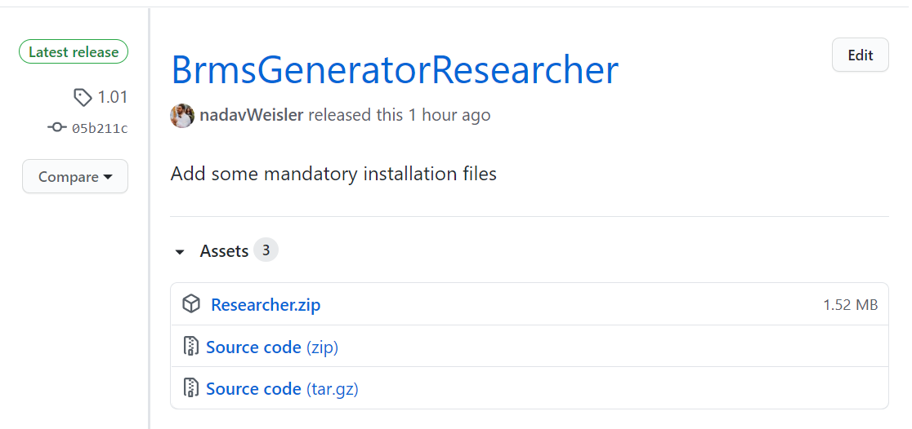

Installation
===============

bRMS Generator - Researcher
------------------------------

Start by downloading the bRMS Generator - Researcher application.
The most recent version can always be found on the GitHub releases page.

The image below shows version 1.01,
but the process is the same for the most recent version.

Release link: https://github.com/nadavWeisler/BrmsGeneratorResearcher/releases/tag/1.01

Download the zip file and start the setup process.

bRMS Generator - Runner
------------------------------

Link: http://www.hujilabconscious.com/
