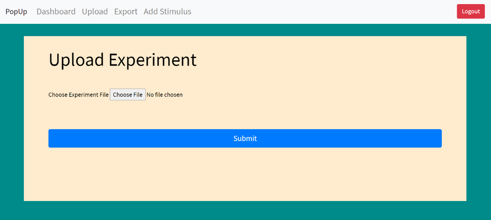
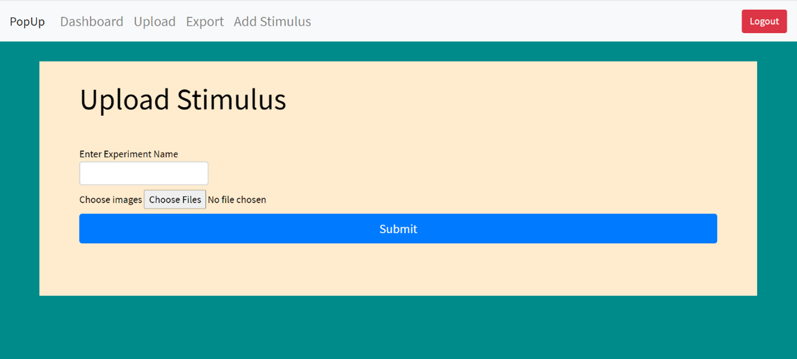
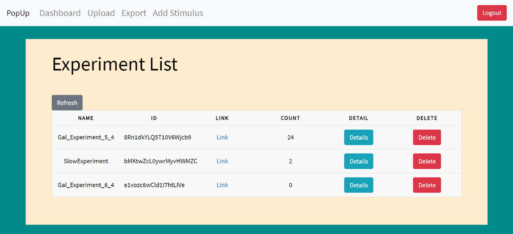
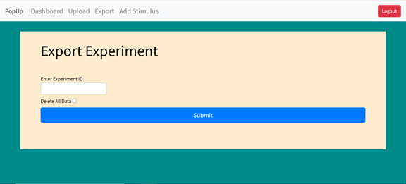

Web Pages
===================

Upload Experiment
------------------

First thing we should upload our experiment.
Press Choose File
button and then file dialog.

Choose your experiment Json file representation
(deeply suggest generating it on
bRMS Generator - Researcher) and press submit.

If the submission failed,
you probably have format error on your JSON file. If you familiar with json format you can try and edit the file yourself, otherwise we suggest you create new JSON file.

After the experiment submission we still need
to upload the relevant stimulus, as explained in the next section.

Upload Stimulus
-----------------

After experiment JSON file upload,
we should upload our stimuli.

In bRMS generator - Web stimuli is a JPG image.
You should combine all your stimuli to
zip files (Its better to combine for group
of 100 stimulus just to be bullet proof).

Then, upload the stimulus zip files with
the relevant experiment name
(which you can see in the dashboard).

Dashboard
-----------

In the dashboard section we can see all the experiment we made.

For each experiment we can see

•	Name

•	Id
•	Participants count.

•	Details.

We are also having a link to the experiment and able to delete it.

Export Experiment
---------------------

In this window we can export experiment,
we only need to enter experiment Id.
We also can delete all the saved data
**(very dangerous and not recommended!)**.
After press submit results csv file will
be downloaded to your computer.

